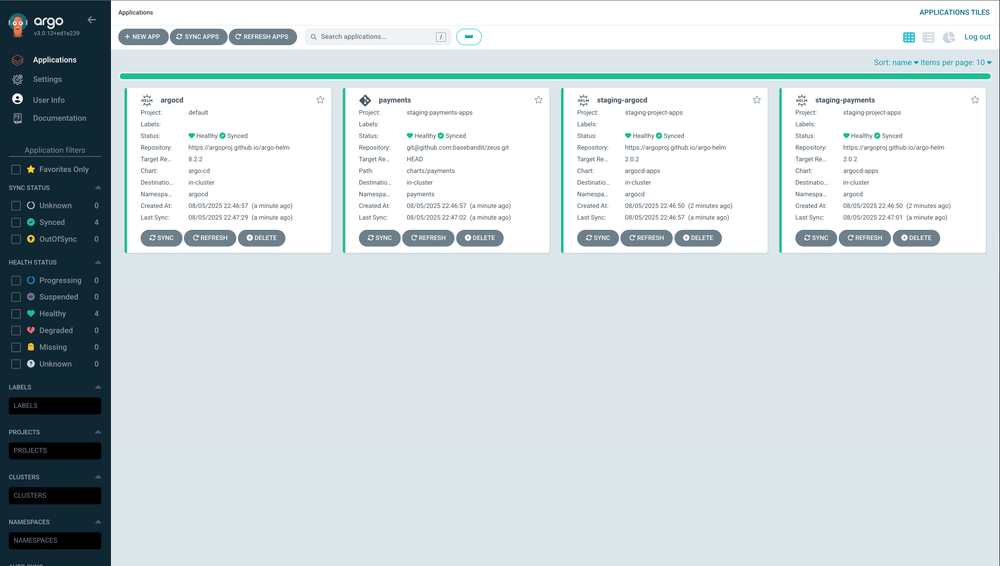
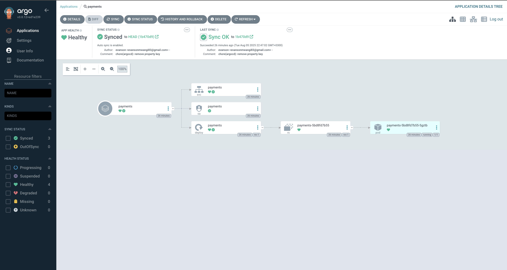

# AWS EKS Cluster Setup (with ArgoCD GitOps)

This project provisions a development platform on Amazon EKS cluster using Terraform. The setup includes VPC networking, EKS control plane, worker nodes, and bootstrapping ArgoCD for GitOps workflows.

---

## ✅ What This Project Does

- Provisions a secure and scalable **VPC** with public/private subnets
- Deploys an **Amazon EKS Cluster** with worker nodes (Node Groups)
- Installs **ArgoCD** and **ArgoCD Image Updater** via Helm using Terraform
- Uses **EKS Pod Identity Agent** (instead of IRSA) for managing IAM roles for service accounts

---

## 🧰 Prerequisites

- Terraform CLI ≥ 1.3
- AWS CLI configured with a profile or IAM credentials
- kubectl configured (will be needed to interact with EKS)
- Helm CLI (for optional local management)

---

## 📁 Project Structure

```
.
├── charts
│   ├── argocd
│   │   └── argocd-server
│   │       ├── argocd-config
│   │       ├── staging-argocd-image-updater-values.yaml
│   │       └── staging-argocd-values.yaml
│   └── rbac
├── infrastructure
│   └── staging
│       ├── argo-image-updater.tf
│       ├── argocd.tf
│       ├── eks.tf
│       ├── igw.tf
│       ├── locals.tf
│       ├── nat.tf
│       ├── nodes.tf
│       ├── outputs.tf
│       ├── pod-identity-addon.tf
│       ├── providers.tf
│       ├── routes.tf
│       ├── subnets.tf
│       ├── terraform.tfstate
│       ├── variables.tf
│       └── vpc.tf
└── README.md
```

---

## 🚀 Step-by-Step Setup

### ✅ Step 1: Provision the VPC (tag: `v1.0.0`)

```bash
git checkout v1.0.0
cd infrastructure/staging
terraform init
terraform apply
```

This sets up the VPC, subnets, NAT Gateway, Internet Gateway, and route tables.

---

### ✅ Step 2: Provision the EKS Cluster (tag: `v2.0.0`)

```bash
git checkout v2.0.0
cd infrastructure/staging
terraform init
terraform apply
```

This step provisions the EKS control plane, node groups (e.g. `t3.medium`), IAM roles for nodes, and enables the **EKS Pod Identity Agent** instead of traditional IRSA.

---

### ✅ Step 3: Install and Configure ArgoCD via Helm (tag: `v3.0.0`)

```bash
git checkout v3.0.0
cd infrastructure/staging
terraform init
terraform apply
```

This step deploys:

- ArgoCD Helm chart
- ArgoCD Image Updater
- Custom values from `charts/argocd/argocd-server/*.yaml`
- ArgoCD is deployed in the `argocd` namespace and bootstrapped for GitOps
- Uses **Pod Identity Agent** for access to AWS (e.g., fetching ECR credentials)

---

## 🧹 Clean Up

To tear down all infrastructure:

```bash
terraform destroy
```

To destroy only ArgoCD resources:

```bash
terraform destroy -target=helm_release.argocd -target=helm_release.argocd_image_updater
```
---

## 🖥️ ArgoCD UI

Below are screenshots from the deployed ArgoCD instance showing the GitOps application dashboards:

### 🔹 ArgoCD Dashboard (App of Apps)



---

### 🔹 Staging Payments Application View



---

## 📝 Notes

- Make sure your AWS vCPU limits can support the desired number of nodes (e.g. t3.medium).
- Default ArgoCD configs are set to run with minimal replicas and resources. Adjust accordingly based on cluster capacity.
- Pod scheduling issues may arise on underpowered nodes (e.g. t3.micro) due to ArgoCD controller resource limits.

---

Built for educational purposes, you will need a lot more configuring for a production-ready environment.

