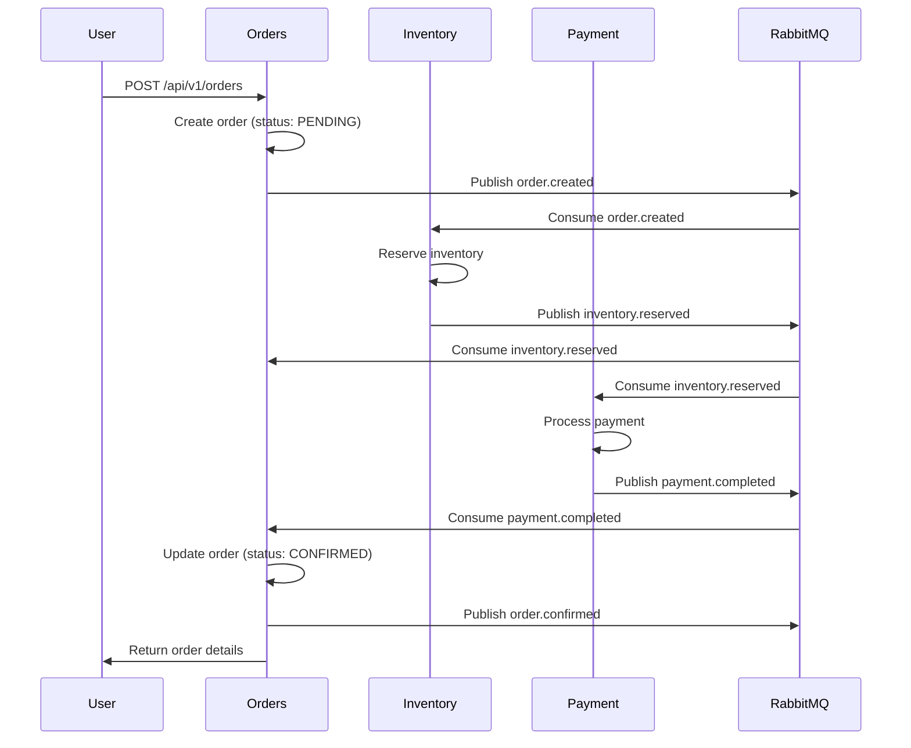
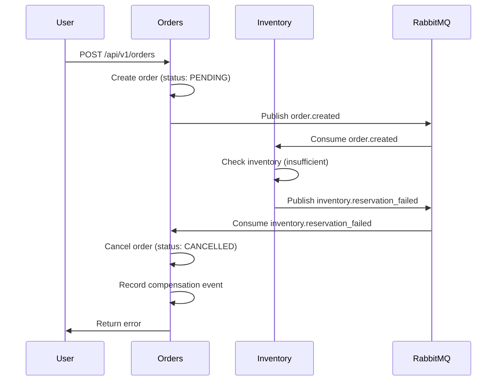
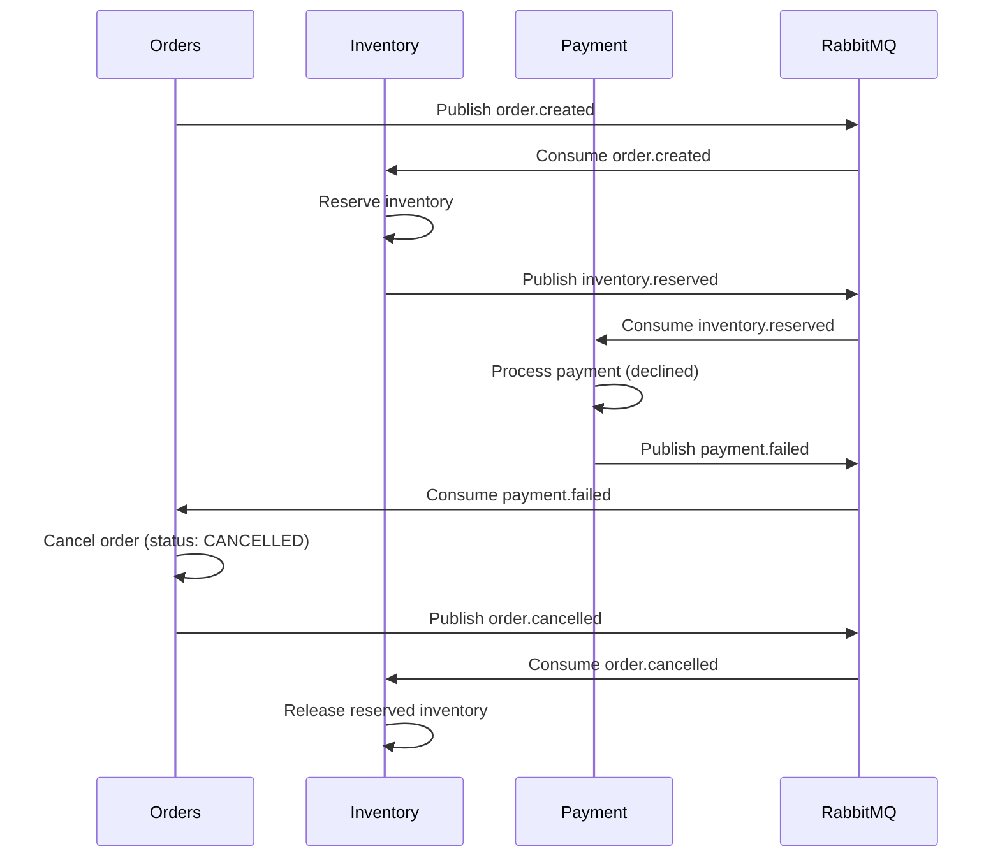
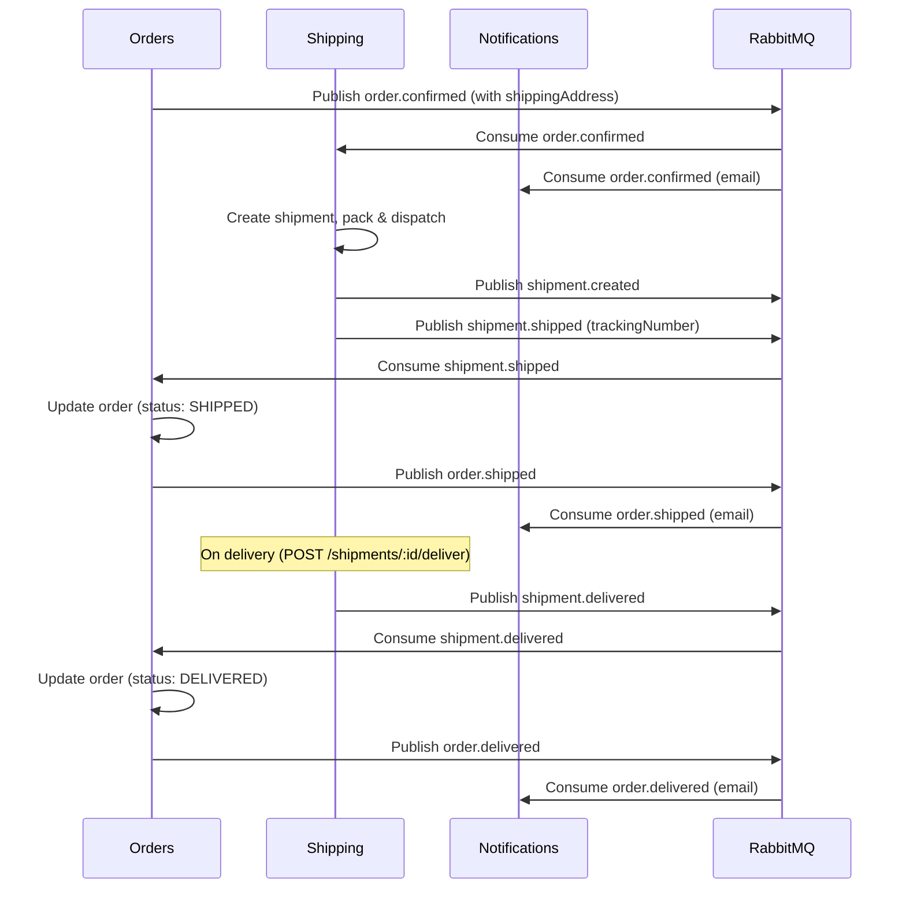

# Saga Pattern Implementation

## Overview

The Orders service implements the **Saga orchestration pattern** to manage distributed transactions across multiple microservices. When a user creates an order, the service coordinates with Inventory and Payment services to ensure data consistency even when failures occur.

## Event-Driven Architecture

### Message Broker
- **RabbitMQ** with topic exchange: `basebandit.events`
- **Durable queues** with dead letter queues (DLQ) for failed messages
- **Retry mechanism**: Up to 3 retries with exponential backoff
- **Persistent messages**: All events survive broker restarts

### Queue Configuration
```
orders.payment_events
├── Routing keys: payment.completed, payment.failed
└── DLQ: orders.payment_events.dlq

orders.inventory_events
├── Routing keys: inventory.reserved, inventory.reservation_failed
└── DLQ: orders.inventory_events.dlq

orders.shipment_events
├── Routing keys: shipment.shipped, shipment.delivered
└── DLQ: orders.shipment_events.dlq
```

> The saga now spans five services. **Auth** issues the JWT (enforced at the gateway),
> **Shipping** fulfills confirmed orders, and **Notifications** emails the customer on key
> transitions. Orders remains the sole owner of order *status*: it consumes `shipment.shipped` /
> `shipment.delivered` and re-emits `order.shipped` / `order.delivered` for downstream consumers.

## Saga Flow

### Happy Path: Order Creation Success



### Failure Path: Insufficient Inventory



### Failure Path: Payment Declined



### Fulfillment Path: Shipping & Delivery



## Event Types

### Published by Orders Service

#### order.created
```json
{
  "eventType": "order.created",
  "orderId": "uuid",
  "userId": "uuid",
  "totalAmount": 99.99,
  "items": [
    {
      "productId": "uuid",
      "quantity": 2,
      "unitPrice": 49.99
    }
  ],
  "timestamp": "2026-01-14T12:00:00Z"
}
```

#### order.confirmed
```json
{
  "eventType": "order.confirmed",
  "orderId": "uuid",
  "userId": "uuid",
  "paymentId": "uuid",
  "shippingAddress": {
    "street": "123 Main St",
    "city": "San Francisco",
    "state": "CA",
    "zipCode": "94105",
    "country": "US"
  },
  "timestamp": "2026-01-14T12:00:30Z"
}
```

#### order.shipped
```json
{
  "eventType": "order.shipped",
  "orderId": "uuid",
  "userId": "uuid",
  "trackingNumber": "ZX0123456789AB",
  "timestamp": "2026-01-14T12:05:00Z"
}
```

#### order.delivered
```json
{
  "eventType": "order.delivered",
  "orderId": "uuid",
  "userId": "uuid",
  "timestamp": "2026-01-15T09:00:00Z"
}
```

#### order.cancelled
```json
{
  "eventType": "order.cancelled",
  "orderId": "uuid",
  "userId": "uuid",
  "reason": "Payment failed",
  "timestamp": "2026-01-14T12:00:45Z"
}
```

### Consumed by Orders Service

#### payment.completed
```json
{
  "eventType": "payment.completed",
  "orderId": "uuid",
  "paymentId": "uuid",
  "userId": "uuid",
  "amount": 99.99,
  "currency": "USD",
  "paymentMethod": "credit_card",
  "timestamp": "2026-01-14T12:00:25Z"
}
```

#### payment.failed
```json
{
  "eventType": "payment.failed",
  "orderId": "uuid",
  "userId": "uuid",
  "amount": 99.99,
  "currency": "USD",
  "reason": "Insufficient funds",
  "errorCode": "INSUFFICIENT_FUNDS",
  "timestamp": "2026-01-14T12:00:25Z"
}
```

#### inventory.reserved
```json
{
  "eventType": "inventory.reserved",
  "orderId": "uuid",
  "reservationId": "uuid",
  "items": [
    {
      "productId": "uuid",
      "quantity": 2
    }
  ],
  "timestamp": "2026-01-14T12:00:10Z"
}
```

#### inventory.reservation_failed
```json
{
  "eventType": "inventory.reservation_failed",
  "orderId": "uuid",
  "items": [
    {
      "productId": "uuid",
      "quantity": 2,
      "available": 1
    }
  ],
  "reason": "Insufficient inventory",
  "timestamp": "2026-01-14T12:00:10Z"
}
```

#### shipment.shipped
```json
{
  "eventType": "shipment.shipped",
  "shipmentId": "uuid",
  "orderId": "uuid",
  "userId": "uuid",
  "trackingNumber": "ZX0123456789AB",
  "carrier": "ZeusExpress",
  "timestamp": "2026-01-14T12:05:00Z"
}
```

#### shipment.delivered
```json
{
  "eventType": "shipment.delivered",
  "shipmentId": "uuid",
  "orderId": "uuid",
  "userId": "uuid",
  "timestamp": "2026-01-15T09:00:00Z"
}
```

## Error Handling

### Retry Strategy
- **Max retries**: 3 attempts per message
- **Retry header**: `x-retry-count` tracks attempts
- **TTL**: 60 seconds before reprocessing
- **DLQ**: Messages exceeding max retries go to dead letter queue

### Idempotency
- Order events are recorded in `order_events` table
- Event sourcing pattern captures all state transitions
- Prevents duplicate processing of same event

### Monitoring Failed Messages
```bash
# Check DLQ messages
make redis-cli
> KEYS orders.*dlq*

# Inspect RabbitMQ management UI
open http://localhost:15672
# Username: guest, Password: guest
```

## Code Organization

```
src/
├── events/
│   ├── dto/
│   │   ├── payment-events.dto.ts      # Payment event interfaces
│   │   ├── inventory-events.dto.ts    # Inventory event interfaces
│   │   └── shipment-events.dto.ts     # Shipment event interfaces
│   ├── payment.handler.ts             # Payment event handlers
│   ├── inventory.handler.ts           # Inventory event handlers
│   ├── shipment.handler.ts            # Shipment event handlers
│   └── event.module.ts                # Wires up consumers on startup
├── services/
│   ├── event.service.ts               # RabbitMQ publish/consume logic
│   └── order.service.ts               # Business logic + Saga coordination
└── entities/
    └── order.entity.ts                # OrderEvent for event sourcing
```

## Implementation Details

### Event Service ([event.service.ts](src/services/event.service.ts))
- Manages RabbitMQ connection with `amqp-connection-manager`
- Creates durable topic exchange
- Publishes events with routing keys
- Sets up consumers with DLQ and retry logic

### Event Handlers ([payment.handler.ts](src/events/payment.handler.ts), [inventory.handler.ts](src/events/inventory.handler.ts))
- Processes incoming events
- Calls OrderService business logic methods
- Logs processing steps
- Throws errors to trigger retry mechanism

### Event Module ([event.module.ts](src/events/event.module.ts))
- Implements `OnModuleInit` to start consumers on startup
- Binds handler methods to event service consumers
- Dependency injection for OrderService

## Testing Saga Flow

Since Inventory and Payment services aren't implemented yet, you can simulate the flow:

### 1. Create an order
```bash
curl -X POST http://localhost:8080/api/v1/orders \
  -H "Content-Type: application/json" \
  -d '{
    "userId": "123e4567-e89b-12d3-a456-426614174000",
    "items": [{
      "productId": "550e8400-e29b-41d4-a716-446655440000",
      "quantity": 2
    }],
    "shippingAddress": {
      "street": "123 Main St",
      "city": "San Francisco",
      "state": "CA",
      "zipCode": "94105",
      "country": "US"
    }
  }'
```

### 2. Check logs
```bash
make logs-orders
# You should see: "Published event: order.created"
# And: "Consuming payment events..." and "Consuming inventory events..."
```

### 3. Simulate payment completion (manual test)
```bash
# Publish to RabbitMQ directly using management UI or a test script
# This will be automatic once Payment service is implemented
```

### 4. Verify order status changed
```bash
curl http://localhost:8080/api/v1/orders/{ORDER_ID}
# status should be "confirmed" after payment.completed event
```

## Status & Next Steps

Implemented:
- ✅ **Inventory Service (Go)** — consumes `order.created`, publishes `inventory.reserved`/`inventory.reservation_failed`
- ✅ **Payment Service (Python)** — consumes `inventory.reserved`, publishes `payment.completed`/`payment.failed`
- ✅ **Shipping Service (Python)** — consumes `order.confirmed`/`order.cancelled`, publishes `shipment.created`/`shipment.shipped`/`shipment.delivered`
- ✅ **Notifications Service (Java)** — consumes order/payment events + `user.registered`, sends email
- ✅ **Auth Service (Java)** + **API Gateway (Go)** — JWT issued by auth, validated at the gateway

Future:
1. **Migrate orchestration to Temporal** — the current saga is **event-choreographed** across
   services (each reacts to events). The intended evolution is to model the order saga as a Temporal
   workflow in the Orders service: deterministic orchestration, built-in retries/timeouts, and
   first-class compensation, replacing the hand-rolled DLQ/retry choreography. The event contracts
   above stay the same; Temporal becomes the coordinator.
2. **Compensating transactions**: payment refunds, and publish `inventory.released` on cancellation
   (inventory currently releases internally on `order.cancelled`).
3. **Observability**: distributed tracing (e.g. Jaeger/OpenTelemetry) to visualize saga flows.
