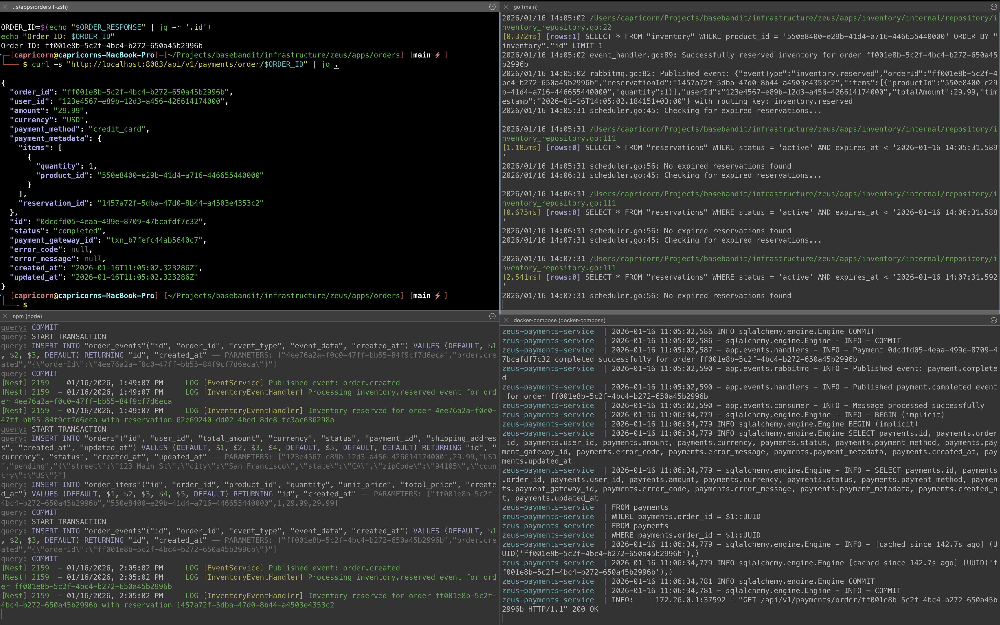

# Payment Service

Microservice for processing payments in the Zeus e-commerce platform using event-driven architecture.

## Overview

The Payment service is part of a distributed SAGA pattern implementation that coordinates order processing across multiple microservices.

## Architecture

- **Framework**: FastAPI (Python 3.12+)
- **Database**: PostgreSQL (port 5434 for isolation)
- **Message Broker**: RabbitMQ (shared with other services on port 5672)
- **ORM**: SQLAlchemy 2.0 with async support
- **Migrations**: Alembic

## Event Flow

### Consumed Events
- **`inventory.reserved`**: When Inventory service successfully reserves stock

### Published Events
- **`payment.completed`**: Payment processed successfully
- **`payment.failed`**: Payment processing failed

## Getting Started

### Installation
```bash
make install
```

### Database Setup
```bash
make docker-up-db
make migrate-up
```

### Running
```bash
make dev  # Development with auto-reload
make docker-up  # Docker
```

### Running the Full System Locally

To test the complete payment flow, run all services (Orders, Inventory, Payments) along with RabbitMQ and their databases:



The screenshot shows:
- **Top-left**: Orders service creating an order and querying the payment
- **Top-right**: Inventory service (Go) reserving stock and publishing events
- **Bottom-left**: Orders service logs showing event publishing
- **Bottom-right**: Payments service processing the `inventory.reserved` event and completing payment

## API Endpoints

- `GET /healthz` - Health check
- `POST /api/v1/payments` - Create payment
- `GET /api/v1/payments/{id}` - Get payment by ID
- `GET /api/v1/payments/order/{order_id}` - Get payment by order ID

## Configuration

See `.env.example` for all configuration options.

## Testing

Run the Orders service test script to test the full integration:
```bash
cd ../orders && ./test-api.sh
```

For more details, see the full documentation in the service code.
